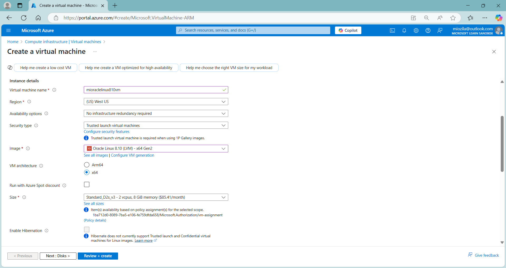
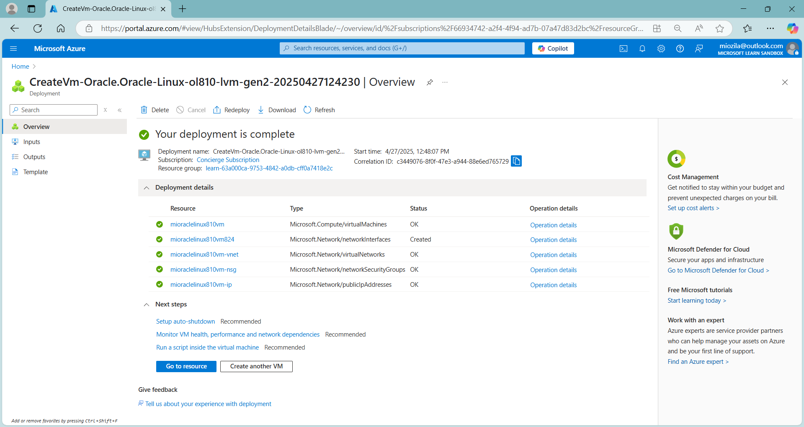
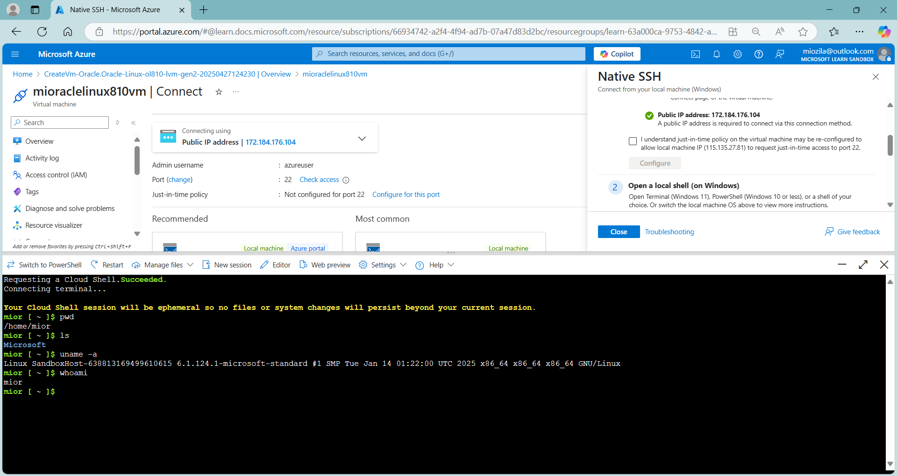
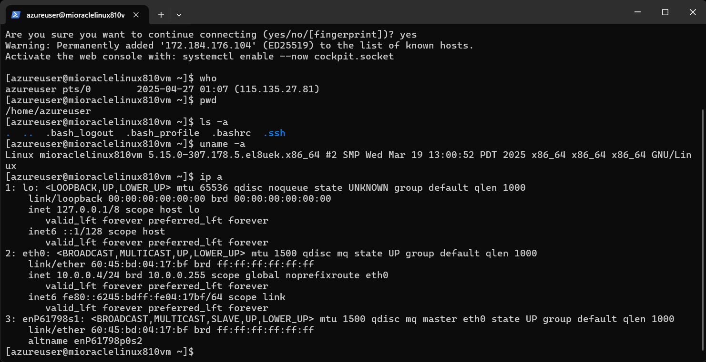
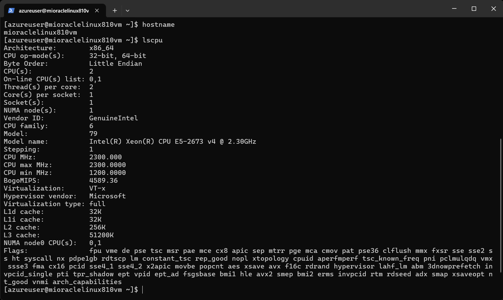
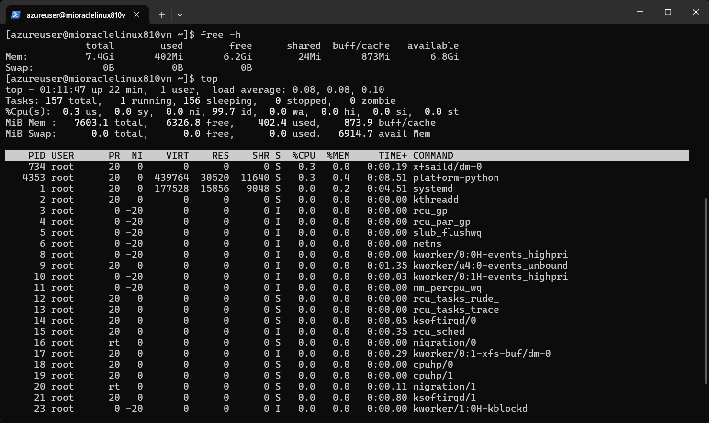

# oraclecomput 🐧
oraclecomput : #oracle_linux8 #compute #virtual_machine #bash #ssh key-pair

## Objective
Create a linux virtual machine in Azure

## Similar Skills Set
- GCP : Compute Engine
- AWS : EC2
- Linux : RHEL, SUSE, Ubuntu, CentOS, Debian

## Oracle Linux 8.10 (LVM) Virtual Machine Compute

